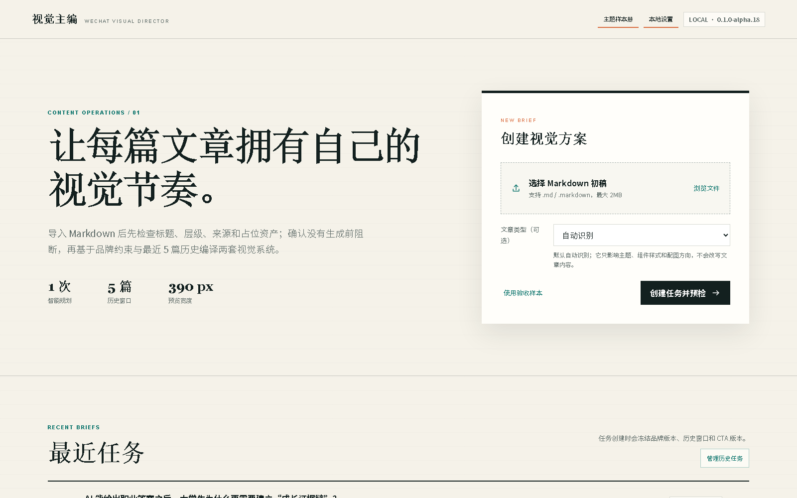
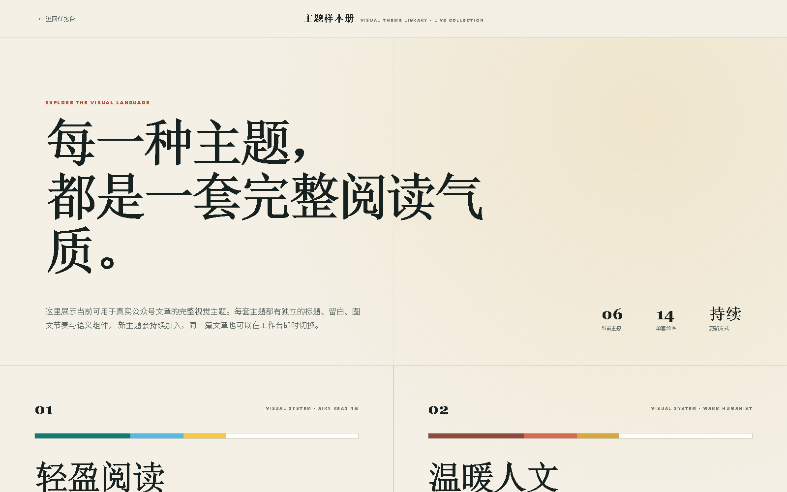

# WeChat Visual Director

> 把公众号主题、资料或 Markdown 初稿，转换为可人工确认、可复制交付、可写入微信公众号草稿箱的视觉文章。

[](https://github.com/zhouke0929/wechat-visual-director/releases)
[](https://github.com/zhouke0929/wechat-visual-director/actions/workflows/ci.yml)
[](LICENSE)
[](#系统要求)
[](#macos-技术预览)

`wechat-visual-director` 是一个本地优先的开源 Skill + 可视化工作台。宿主 Agent 负责理解文章并输出受控的 `EditorialBrief`，本地核心负责结构校验、主题选择、组件编译和微信兼容渲染。运营在浏览器中确认整篇主题、图片与封面，模型不直接自由生成整段 HTML/CSS。

当前版本：**v0.1.0-alpha.18**。项目已在真实公众号生产流程中完成文章交付，但仍处于 Alpha 阶段；它不是 SaaS，也不会自动群发文章。

本项目与腾讯、微信官方无隶属或背书关系。



## 先看这件事：Wenyan 不会随本项目自动安装

Visual Director 的基础安装器**不会自动安装全局 npm 工具**。因此：

- 只做排版、单稿推荐、整篇换主题、富文本复制和交付包下载：**不需要 Wenyan，也不需要 Node.js**；
- 生成图片：按需配置图片 Provider，或直接人工上传；
- 点击“保存到微信公众号草稿箱”：**必须额外安装 Node.js 与 Wenyan CLI**，并配置公众号凭据和公网 IP 白名单。

这是刻意的产品边界，不是安装失败。Wenyan 是可选的第三方发布适配器，全局安装会修改用户的 npm 环境，所以项目不会在用户不知情时静默安装。

需要完整草稿交付时，请先执行：

```powershell
node --version
npm --version
npm install -g @wenyan-md/cli@2.0.11
wenyan --version
```

建议使用 Node.js 20 或更高版本。当前最低兼容 Wenyan 版本为 `2.0.1`，项目已审计并推荐 `2.0.11`。Wenyan 的源码与许可见 [caol64/wenyan-cli](https://github.com/caol64/wenyan-cli)。

如果 `npm install` 成功但终端仍提示找不到 `wenyan`，请关闭并重新打开终端，然后检查：

```powershell
npm config get prefix
where.exe wenyan
```

macOS 使用 `which wenyan`。确保 npm 全局可执行目录已经加入 `PATH`。

## 能力分层

| 使用目标 | Visual Director | Python 3.11+ | 图片模型 Key | Node.js + Wenyan | 公众号 AppID / AppSecret | IP 白名单 |
|---|---:|---:|---:|---:|---:|---:|
| 只做排版与预览 | 必需 | 必需 | 不需要 | 不需要 | 不需要 | 不需要 |
| 排版 + AI 生图 | 必需 | 必需 | 可选，人工上传可替代 | 不需要 | 不需要 | 不需要 |
| 完整写入公众号草稿箱 | 必需 | 必需 | 可选 | **必需** | **必需** | **必需** |

无论选择哪一层，最终群发都必须由用户在微信公众号后台人工完成。

## 它解决什么问题

- 固定 Markdown 主题长期使用后，标题、卡片和点缀高度同质化；
- 图片与文章章节关联弱，需要运营逐张复制内容、生成和插入；
- 弱模型可能漏选组件、误判标题层级或破坏正文结构；
- 排版完成后仍要在多个编辑器之间来回复制；
- API Key、公众号密钥和历史任务不适合交给远程 Agent 托管。

Visual Director 将这些问题拆成两层：

1. **Agent 理解语义**：把真实内容整理为规范 Markdown，并生成结构化视觉意图；
2. **本地核心确定性执行**：只使用经过验证的主题、组件和内联样式完成渲染与交付。

H1/H2、数字、来源和事实关系始终受保护。组件只能绑定原文已经存在的语义，不会为了视觉效果补造概念、比较、结论或数据。

## 当前能力

- 4 类文章：数据政策、教程步骤、观点趋势、活力成长；
- 6 套视觉系统：轻盈阅读、温暖人文、编辑对比、理性网格、青春校园、未来科技；
- 12 类语义组件，由当前整篇主题统一决定视觉形态；
- 连续概念词条组、长清单、真实对比段和长文节奏识别；
- 一份自动选中的视觉推荐稿与 390px 移动端预览；
- 六套完整主题可即时切换和回退，不重新调用文本模型或图片模型；
- 最终冻结稿进入最近五篇主题历史，优先避免连续重复；
- 正文配图、结构信息图、人工上传与封面候选；
- `image_visual_intent.v3` 插画型信息图、文章级 Visual DNA 与短标签事实锁定；
- 正文配图与 AI 封面共享整篇美术方向，换主题时保留既有候选并只对明显冲突做轻提示；
- 人工、Mock、OpenAI/Ark/兼容 Images API、Gemini Nano Banana 图片 Provider；
- 本地任务、历史方案、图片选择与冻结版本持久化；
- 历史任务服务端分页（默认每页 8 篇）与当前页批量清理；
- 富文本复制、Markdown/HTML/图片交付包；
- 可选 Wenyan 适配器写入微信公众号草稿箱；
- OpenClaw、OpenCode、Claude Code、Trae 等宿主复用现有文本模型，无需重复配置文本模型 Key；
- Windows 持久安装与升级，macOS 技术预览安装；
- 历史数据扫描、完整备份、显式恢复与批量任务清理。

### 文章类型有什么用

文章类型是视觉规划的软路由，不会修改原文内容，也不会把文章锁死在一套模板里。它目前影响：

- 单稿主题推荐顺序（先避开上一篇，再参考最近五篇使用次数）；
- EditorialBrief 的受众任务、叙事语气与组件视觉样式；
- 配图与封面的视觉概念、色彩和叙事气质。

具体使用哪个组件，仍主要由正文里的步骤、证据、对比、概念、案例等真实语义结构决定；文章类型不会凭空添加组件。

| 类型 | 默认视觉倾向 |
|---|---|
| 数据 / 政策 | 证据、数据核验、审慎决策 |
| 教程 / 步骤 | 顺序、清单、行动复核 |
| 观点 / 趋势 | 观点解释、逻辑路径、现实影响 |
| 活动 / 成长 | 场景、案例、体验与成长变化 |

工作台默认自动识别。只有自动判断明显不符合文章意图时，才需要人工指定；手动选择只是纠错入口。


## 工作流

```text
运营提出主题或提供资料
        ↓
宿主 Agent 生成规范 Markdown + EditorialBrief
        ↓
本地核心校验事实、标题层级和组件绑定
        ↓
确定性组件库生成一份自动选中的推荐稿
        ↓
运营确认整篇主题、图片和封面；不满意可即时换主题或回退
        ↓
冻结最终版本
        ↓
复制全文 / 下载交付包 / 写入微信公众号草稿箱
```

## 快速开始

### 方式一：把仓库链接交给 Agent

适用于 OpenCode、Claude Code、Trae、OpenClaw 或其他具备终端能力、支持 Skill 的 Agent。发送下面这段话：

```text
请从以下固定版本安装或升级 wechat-visual-director。先阅读仓库根目录 INSTALL_FOR_AGENT.md，再执行统一 bootstrap 和健康检查；成功后使用仓库样例创建任务并打开本地评审工作台。不要读取或回显任何 API Key、AppSecret 或 Cookie。注意：基础安装不会自动安装 Wenyan；如果我要直接写入微信公众号草稿箱，请先检查 Node.js 与 Wenyan CLI，并把缺失的人工安装步骤和本地设置地址告诉我。
https://github.com/zhouke0929/wechat-visual-director/tree/v0.1.0-alpha.18
```

安装完成后，请重启宿主 Agent 或新开对话，使它重新扫描本机 Skill 目录。进入新对话不等于重新安装；Agent 应先执行 `doctor --json`。

### 方式二：Windows PowerShell

基础安装只需要 Git 与 Python 3.11+。发行包已经包含构建后的工作台，正常使用不需要 `pnpm dev`。

```powershell
git clone --branch v0.1.0-alpha.18 --depth 1 https://github.com/zhouke0929/wechat-visual-director.git
Set-Location .\wechat-visual-director

$bootstrap = powershell -NoProfile -ExecutionPolicy Bypass -File ".\scripts\bootstrap.ps1" | ConvertFrom-Json
powershell -NoProfile -ExecutionPolicy Bypass -File $bootstrap.launcher doctor --json
powershell -NoProfile -ExecutionPolicy Bypass -File $bootstrap.launcher task create --file ".\samples\skill-alpha\canonical-article.md" --open --json
```

默认安装位置：

```text
%LOCALAPPDATA%\wechat-visual-director\
├── versions\              # 各程序版本
├── data\                  # 任务、图片和冻结产物
├── config\                # 本地私有配置
├── backups\               # 数据恢复前的完整备份
├── runtime\               # PID 与运行日志
├── visual-director.ps1     # PowerShell 稳定入口
├── visual-director.cmd     # CMD / 桌面 Agent 兼容入口
└── uninstall.ps1          # 安全卸载入口
```

升级不会清空 `data/`、`config/` 或 `runtime/`。`doctor --json` 的核心字段应为：

```text
core_ready=true
workbench_ready=true
persistent=true
version_match=true
host_skill_registered=true
```

## 首次配置

打开工作台右上角的“本地设置”，先选择这台电脑要做到哪一步：

- **只做排版**：零外部服务配置，可以立即创建任务；
- **排版 + 生图**：配置图片 Provider，或保留人工上传；
- **完整交付**：在图片能力之外，再连接微信公众号与 Wenyan。

设置属于本机，不属于某个对话。换一个 Agent 窗口后不需要重新填写。


### 图片 Provider

工作台 `/settings` 支持以下模式：

| 模式 | 用途 | 是否需要 Key |
|---|---|---:|
| `manual` | 人工上传、沿用原图或跳过 | 否 |
| `mock` | 本地占位图与交互验收 | 否 |
| `images_api` | OpenAI GPT Image、火山方舟 Seedream、兼容中转站 | 是 |
| `gemini` | Google Nano Banana 原生接口 | 是 |

Key 只保存在 Git 忽略的本机私有配置中；页面与 API 只返回“是否已配置”，不会回显原值。详细协议见 [图片 Provider 说明](references/image-providers.md)。

封面候选支持 5:4 可视化裁切。原图完整展示，裁切框可以拖到画面边缘，并可通过滑条或鼠标滚轮缩放；保存后生成新的受控候选，不会覆盖原图。

同一篇文章的正文插图与 AI 封面会复用一份文章级 Visual DNA：文章决定“画什么、解释什么关系”，当前主题只影响推荐画材、色板、表面语言和构图气质。换主题不会删除已生成或已采用的图片，也不会自动再次扣费；尚未生成的新候选才按当前主题编译。

结构信息图只允许绘制来自原文的标题与短标签，完整事实锚点仍保存在任务中用于核对。系统会把场景隐喻、连接关系和装饰语法作为“只画不写”的视觉脚本，减少长句卡片和提示词说明被误画进图片。


### 微信公众号草稿箱

完成 [Wenyan 安装](#先看这件事wenyan-不会随本项目自动安装) 后，在本地设置页选择“完整交付”，按页面引导完成：

1. 在微信开发者后台的“开发接口管理 / 账号开发信息”中取得 AppID，并生成或重置 AppSecret；栏目名称以微信当前页面为准；
2. 点击“检测当前公网 IP”，把结果加入微信开发者后台的 IP 白名单；`192.168.x.x` 等局域网地址不能作为公网出口 IP；
3. 只在本地设置页填写 AppID 与 AppSecret，不要粘贴到 Agent 对话；
4. 保存后点击“检测连接（不建草稿）”；
5. 只有连接检测通过，冻结页才会启用“保存到微信公众号草稿箱”。

微信 access token 的接口规则见[微信官方文档](https://developers.weixin.qq.com/doc/offiaccount/Basic_Information/Get_access_token.html)。


Visual Director 负责冻结文章和生成微信兼容内联 HTML；Wenyan 负责图片上传与草稿传输。只有界面返回真实 Media ID，才表示草稿已写入公众号后台。

如果结果显示“未知”，先去公众号草稿箱核对，不要立即重复点击，以免创建重复草稿。无论草稿交付成功、失败还是未知，冻结页仍会保留“复制全文”和“下载交付包”，这两个操作不会再次调用微信接口。

## 主题样册

主题不是简单换色。每套主题拥有统一的设计基因、章节装饰和语义组件，规划器会参考最近 5 篇历史视觉摘要，减少连续文章重复使用同一套表达。



## 系统要求

### 基础排版

- Windows 10/11；
- Git；
- Python 3.11 或更高版本；
- 可打开本机 `127.0.0.1` 地址的浏览器。

### 公众号草稿交付附加要求

- Node.js 20 或更高版本；
- `@wenyan-md/cli@2.0.11`；
- 具有相应开发接口权限的微信公众号；
- AppID、AppSecret；
- 当前公网出口 IP 已加入白名单。

### macOS 技术预览

```bash
git clone --branch v0.1.0-alpha.18 --depth 1 https://github.com/zhouke0929/wechat-visual-director.git
cd wechat-visual-director
bash scripts/bootstrap.sh
```

稳定入口位于 `~/Library/Application Support/wechat-visual-director/visual-director`。基础排版、人工图片和交付包不需要 Node.js；使用 Wenyan 创建公众号草稿时才需要另行安装 Node.js 与 Wenyan。macOS 在真实设备完成完整人工验收前标记为 **Technical Preview**。

## 常见问题

### 安装后为什么不能保存到公众号草稿箱？

先运行：

```powershell
& "$env:LOCALAPPDATA\wechat-visual-director\visual-director.ps1" doctor --json
```

重点查看：

```text
capabilities.wechat_draft
publishers.wenyan.installed
publishers.wenyan.ready
publishers.wenyan.install_command
next_action
```

常见情况：

| 现象 | 原因 | 处理 |
|---|---|---|
| `wenyan.installed=false` | 没有安装 Wenyan，或 npm 全局目录不在 PATH | 安装 `@wenyan-md/cli@2.0.11`，重开终端 |
| Wenyan 已安装但 `ready=false` | AppID / AppSecret 未配置 | 打开本地设置，选择“完整交付”并填写凭据 |
| 连接检测提示 IP 错误 | 当前公网出口 IP 未加白名单 | 复制设置页检测到的公网 IP，加入微信开发者后台 |
| 草稿结果为 `unknown` | Wenyan 已执行，但未返回可确认 Media ID | 先人工检查公众号草稿箱，不要自动重试 |
| 复制全文缺少部分图片 | 浏览器剪贴板与微信编辑器对外链图片有额外限制 | 优先使用 Wenyan 草稿交付或下载交付包 |

### 新对话找不到 Skill

安装器会注册通用 Agent Skill 和 OpenCode 命令。部分宿主只在启动时扫描 Skill；请完全重启宿主应用或新开对话，然后让 Agent 先运行 `doctor --json`。不要重新执行临时源码中的 `uvicorn`、`pnpm dev` 或旧启动脚本。

### 工作台打不开

让 Agent 使用稳定入口诊断：

```powershell
& "$env:LOCALAPPDATA\wechat-visual-director\visual-director.ps1" doctor --json
```

不要手工同时启动多个 API / Web 服务。当前版本使用单个本地 FastAPI 服务托管 API 和静态工作台，正常运行不依赖 3000 端口。

### 重装后看不到旧任务

先停止服务并只读扫描旧数据，**不要只复制 SQLite 文件**：

```powershell
& "$env:LOCALAPPDATA\wechat-visual-director\visual-director.ps1" stop --json
& "$env:LOCALAPPDATA\wechat-visual-director\visual-director.ps1" data scan --candidate "C:\旧源码\apps\api\data" --json
```

数据集由数据库、`image-assets` 和 `publication-assets` 共同组成。恢复前程序会创建完整备份；目标已有任务时必须由用户核对扫描结果并明确确认。

## 升级、卸载与数据保留

普通卸载会移除程序和宿主 Skill 注册，但保留任务、图片与本机私有配置：

```powershell
powershell -NoProfile -ExecutionPolicy Bypass -File "$env:LOCALAPPDATA\wechat-visual-director\uninstall.ps1"
```

只有明确不再保留任何本机数据时才使用：

```powershell
powershell -NoProfile -ExecutionPolicy Bypass -File "$env:LOCALAPPDATA\wechat-visual-director\uninstall.ps1" -Purge
```

两种方式都不会删除用户自己的 Git 源码目录。

## 文本规划

作为 Skill 使用时，默认复用宿主 Agent 已配置的文本模型。核心只向宿主提供安全文章块、公开品牌规则和最近视觉摘要；宿主返回 `EditorialBrief` 后，本地执行 Schema 校验、结构规范化和确定性编译。

满足以下条件，才表示本次确实使用了宿主规划：

```text
planner_provider=host_agent
fallback_used=false
```

若宿主输出不合法，系统会标记 `fallback_used=true` 并退回只使用原稿事实的规则方案。只上传 Markdown 也可以零配置使用规则规划；本地核心不会再要求或调用独立文本模型 Key。

## 数据与安全边界

- `.env.local`、本地配置、任务数据库、图片、诊断产物和内部文章均被 Git 忽略；
- 不要把 AppSecret、API Key、Cookie 或 Token 发给 Agent；
- 真实品牌图、二维码、公司名称与内部评测材料不进入公开仓库；
- 图片候选必须经过人工确认；
- 同一输入默认复用既有任务，避免 Agent 重试制造重复草稿；
- 创建公众号草稿不等于最终群发，最终发布始终保留人工门禁。

## 仓库结构

```text
├── SKILL.md                 # Agent 触发条件、工作流与安全门禁
├── INSTALL_FOR_AGENT.md     # Agent 安装、升级、诊断与恢复说明
├── agents/openai.yaml       # Skill UI 元数据
├── scripts/                 # 安装器、稳定启动器和公开验证脚本
├── apps/api/                # FastAPI、SQLite、规划、组件与发布适配器
├── apps/web/                # React/Vite 源码与预构建静态工作台
├── references/              # 文章协议、CLI 契约、图片 Provider 说明
├── samples/                 # 中性公开样例与回归样本
├── contracts/               # EditorialBrief、OpenAPI 等契约
├── assets/brand/            # 不含真实企业资料的示例品牌
└── docs/                    # 产品决策、质量基线、截图与发布记录
```

## 开发验证

```powershell
$env:PYTHONPATH="apps/api/src"
python -m pytest apps/api/tests -q
corepack pnpm@11.7.0 --dir apps/web typecheck
corepack pnpm@11.7.0 --dir apps/web build
```

Windows 与 macOS 的核心测试、静态工作台构建和安装脚本校验由 GitHub Actions 持续执行。Windows 是正式支持平台；macOS 当前为技术预览。

## License

本项目采用 [Apache License 2.0](LICENSE)。第三方依赖和外部服务仍分别受其自身许可证与使用条款约束。
