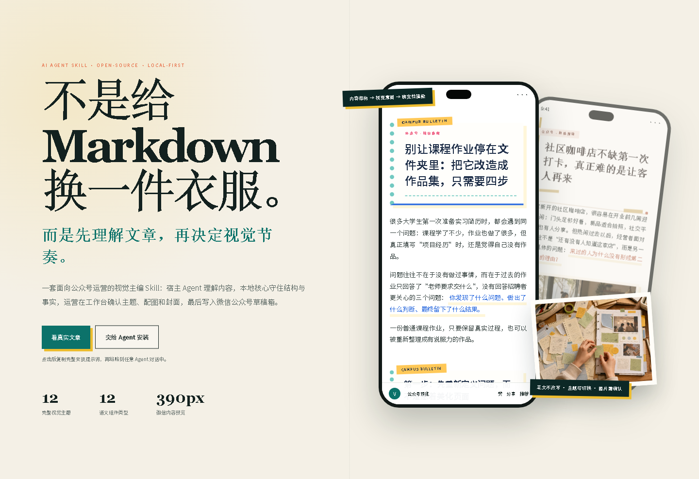
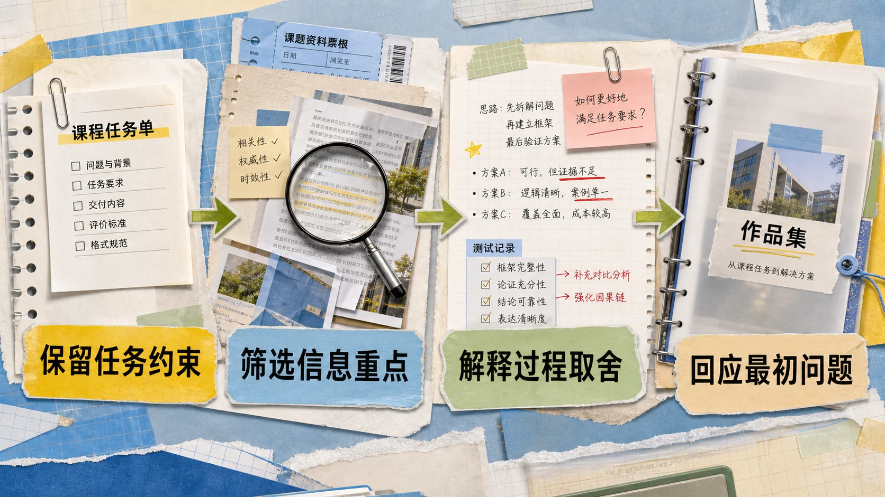
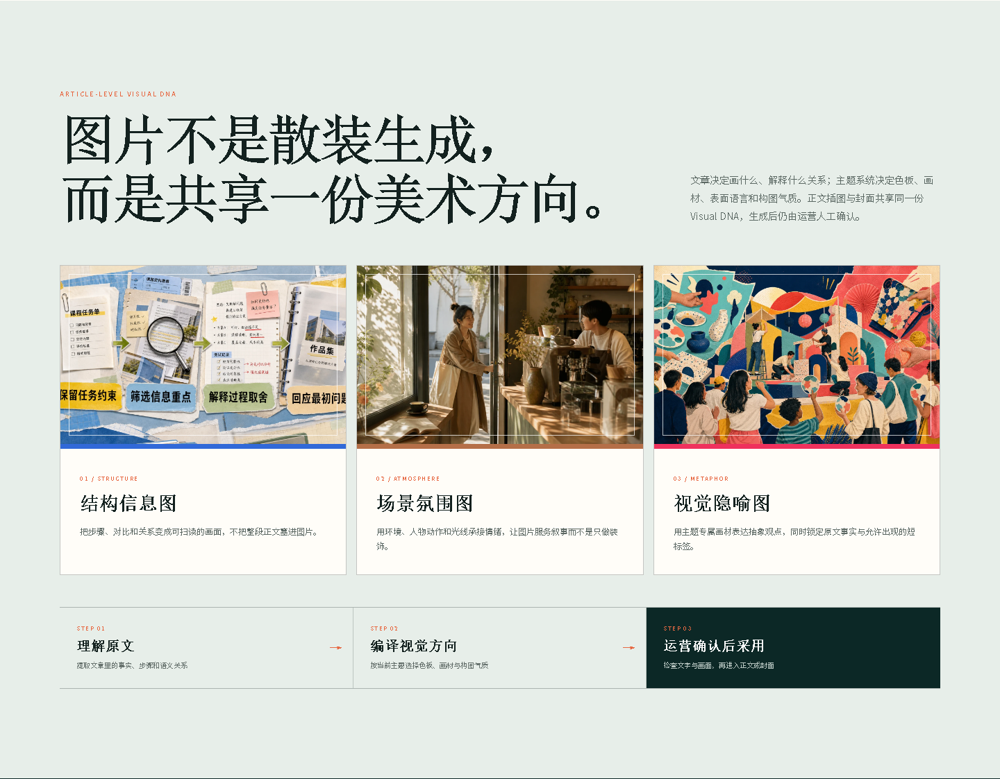
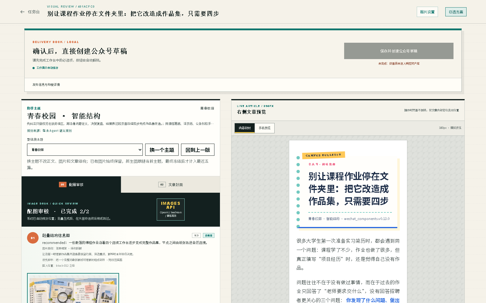
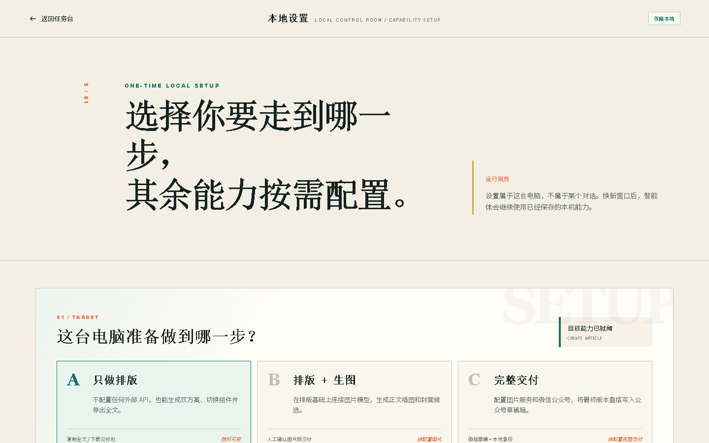
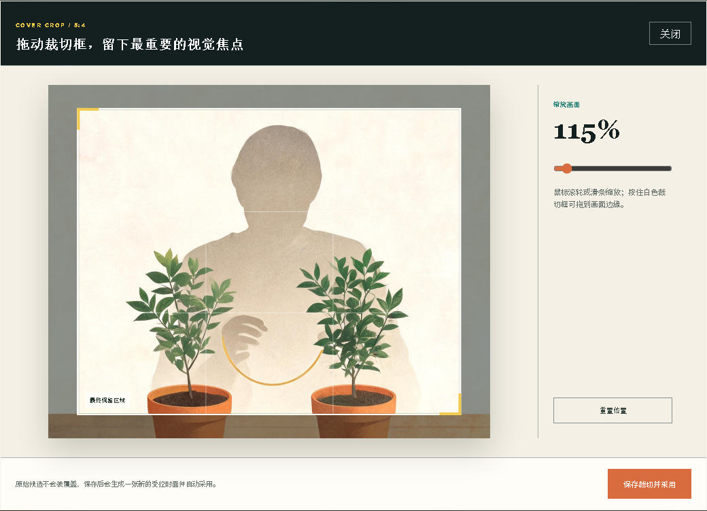
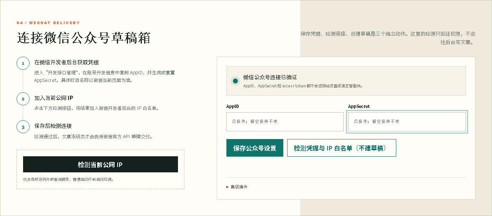
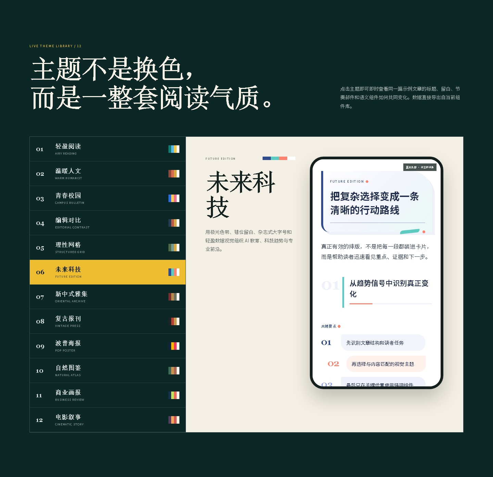

# WeChat Visual Director

> 把公众号主题、资料或 Markdown 初稿，转换为可人工确认、可复制交付、可写入微信公众号草稿箱的视觉文章。

[](https://github.com/zhouke0929/wechat-visual-director/releases)
[](https://github.com/zhouke0929/wechat-visual-director/actions/workflows/ci.yml)
[](LICENSE)
[](#系统要求)
[](#macos-技术预览)

`wechat-visual-director` 是一个本地优先的开源 Skill + 可视化工作台。宿主 Agent 负责理解文章，本地核心负责结构校验、主题选择、组件编译和微信兼容渲染；运营只需要确认整篇主题、图片与封面。模型不会自由生成整段 HTML/CSS，也不会绕过人工确认自动群发。

<p align="center">
  <a href="https://zhouke0929.github.io/wechat-visual-director/"><b>在线浏览产品与 12 套主题</b></a>
  ·
  <a href="https://github.com/zhouke0929/wechat-visual-director/releases"><b>下载最新 Release</b></a>
  ·
  <a href="#快速开始"><b>交给 Agent 安装</b></a>
</p>



## 一句话理解

它不是给 Markdown 固定换一件衣服，而是先让 Agent 理解“这篇文章在解释什么关系”，再用确定性的主题和组件把重点、证据、步骤与节奏呈现出来。

```text
主题 / 资料 / Markdown
          ↓
宿主 Agent：理解内容，生成受控 EditorialBrief
          ↓
本地核心：保护事实与结构，编译主题、组件和图片意图
          ↓
人工工作台：换主题、确认图片、裁封面、手机预览
          ↓
复制全文 / 下载交付包 / 创建微信公众号草稿
```

## 三篇完整展示案例

下面三篇是为公开展示准备的完整示例，不使用公司内部稿件或运营数据。它们使用同一套核心，但分别选择「青春校园」「温暖人文」「波普海报」。这也是项目最重要的差异：不是让所有内容长得一样，而是让视觉语言服务文章本身。

<table>
  <tr>
    <td width="33%"></td>
    <td width="33%"></td>
    <td width="33%"></td>
  </tr>
  <tr>
    <td><b>教程步骤</b><br>把课程作业改造成作品集</td>
    <td><b>本地商业</b><br>社区咖啡店如何让客人再来</td>
    <td><b>品牌观点</b><br>联名越做越多为何反而记不住</td>
  </tr>
  <tr>
    <td><a href="https://zhouke0929.github.io/wechat-visual-director/articles/campus.html">查看完整排版</a></td>
    <td><a href="https://zhouke0929.github.io/wechat-visual-director/articles/coffee.html">查看完整排版</a></td>
    <td><a href="https://zhouke0929.github.io/wechat-visual-director/articles/pop-collaboration.html">查看完整排版</a></td>
  </tr>
</table>

案例图片由 OpenAI 图像生成能力产生，并作为人工候选插入文章；结构信息图仍需要用户核对文字后才能进入最终交付。

## 图片也有文章级 Visual DNA

配图并不是每个章节各自“抽卡”。Visual Director 会先从原文提取内容事实与语义关系，再由当前文章主题编译色板、画材、表面语言和构图气质。正文插图与 AI 封面共享同一份文章级 Visual DNA；已经生成或采用的图片不会因为换主题被静默删除或重复计费。



结构信息图负责把步骤、对比和关系转成可扫读画面；场景氛围图用环境、人物动作与光线承接叙事；视觉隐喻图则用主题专属画材表达抽象观点。文章决定“画什么、解释什么关系”，主题决定“用什么视觉语言”。系统只允许模型使用原文已经存在的事实与短标签，所有候选仍需人工确认后才能进入最终交付。可以在[在线产品展示页](https://zhouke0929.github.io/wechat-visual-director/#image-system)查看完整案例组合。

## 它和普通 Markdown 排版工具有什么不同

| 维度 | 固定主题渲染 | WeChat Visual Director |
|---|---|---|
| 内容理解 | 主要依赖 Markdown 标签 | 内容结构、读者任务、章节关系与语义组件 |
| 视觉变化 | 切换 CSS 或整套模板 | 12 套完整视觉系统 + 主题内节奏原语与组件变体 |
| 稳定性 | 自由 HTML 容易漂移 | LLM 只输出结构化意图，本地组件确定性渲染 |
| 历史感知 | 通常无 | 最终冻结稿进入最近五篇主题历史，减少连续重复 |
| 图片 | 手动插入或单次生图 | 章节锚点、Visual DNA、结构图/氛围图与人工确认 |
| 交付 | 复制 HTML | 富文本复制、交付包、微信官方 API 草稿写入 |

当前可下载 Release：**v0.1.0-alpha.20**。项目已在真实公众号生产流程中完成文章交付，但仍处于 Alpha 阶段；它不是 SaaS。主分支可能包含尚未打包的新展示与文档改进，普通用户应优先安装 Releases 页面中版本号最高的发布包。项目与腾讯、微信官方无隶属或背书关系。

## Windows 普通用户：开箱安装

Windows x64 Release 已包含 Python 3.11.9、后端依赖和构建后的工作台。普通用户把 Releases 页面链接和安装提示词交给 Agent 后，不需要预先安装 Git、系统 Python、Node.js、pnpm 或 Wenyan。安装器会校验下载包的 SHA-256，再写入本机持久目录。公众号草稿交付由项目内置的微信官方 API 发布器完成。

- 只做排版、换主题、富文本复制和交付包下载：不需要任何外部发布工具；
- 生成图片：按需配置图片 Provider，或直接人工上传；
- 保存到微信公众号草稿箱：只需在本地设置中配置 AppID、AppSecret，并把当前公网出口 IP 加入白名单。

AppSecret 和访问令牌不会写入任务数据库；访问令牌只保存在当前后台进程内存中。

## 能力分层

| 使用目标 | Visual Director | 额外运行环境 | 图片模型 Key | 公众号 AppID / AppSecret | IP 白名单 |
|---|---:|---:|---:|---:|---:|
| 只做排版与预览 | 必需 | Windows 无 | 不需要 | 不需要 | 不需要 |
| 排版 + AI 生图 | 必需 | Windows 无 | 可选，人工上传可替代 | 不需要 | 不需要 |
| 完整写入公众号草稿箱 | 必需 | Windows 无 | 可选 | **必需** | **必需** |

无论选择哪一层，最终群发都必须由用户在微信公众号后台人工完成。

## 它解决什么问题

- 固定 Markdown 主题长期使用后，标题、卡片和点缀高度同质化；
- 图片与文章章节关联弱，需要运营逐张复制内容、生成和插入；
- 弱模型可能漏选组件、误判标题层级或破坏正文结构；
- 排版完成后仍要在多个编辑器之间来回复制；
- API Key、公众号密钥和历史任务不适合交给远程 Agent 托管。

Visual Director 将这些问题拆成两层：

1. **Agent 理解语义**：把真实内容整理为规范 Markdown，并生成结构化视觉意图；
2. **本地核心确定性执行**：只使用经过验证的主题、组件和内联样式完成渲染与交付。

H1/H2、数字、来源和事实关系始终受保护。组件只能绑定原文已经存在的语义，不会为了视觉效果补造概念、比较、结论或数据。

## 当前能力

- 4 类内容结构：数据解读、步骤指南、趋势分析、案例叙事；
- 12 套视觉系统：轻盈阅读、温暖人文、编辑对比、理性网格、青春校园、未来科技、新中式雅集、复古报刊、波普海报、自然图鉴、商业画报、电影叙事；
- 12 类语义组件，由当前整篇主题统一决定视觉形态；
- 连续概念词条组、长清单、真实对比段和长文节奏识别；
- 一份自动选中的视觉推荐稿、390px 内容校对视图与拟真手机预览；
- 12 套完整主题可即时切换和回退，不重新调用文本模型或图片模型；
- 最终冻结稿进入最近五篇主题历史，优先避免连续重复；
- 正文配图、结构信息图、人工上传与封面候选；
- `image_visual_intent.v3` 插画型信息图、文章级 Visual DNA 与短标签事实锁定；
- 正文配图与 AI 封面共享整篇美术方向，换主题时保留既有候选并只对明显冲突做轻提示；
- 人工、Mock、OpenAI/Ark/兼容 Images API、Gemini Nano Banana 图片 Provider；
- 本地任务、历史方案、图片选择与冻结版本持久化；
- 历史任务服务端分页（默认每页 8 篇）与当前页批量清理；
- 富文本复制、Markdown/HTML/图片交付包；
- 内置微信官方 API 发布器写入微信公众号草稿箱；
- 具备终端与 Skill 能力的宿主 Agent 可复用现有文本模型，无需重复配置文本模型 Key；
- Windows 持久安装与升级，macOS 技术预览安装；
- 历史数据扫描、完整备份、显式恢复与批量任务清理。

### 内容结构有什么用

“内容结构”描述文章组织信息的方式，不是教育、科技、商业等行业分类。它是视觉规划的软路由，不会修改原文内容，也不会把文章锁死在一套模板里。它目前影响：

- 单稿主题推荐顺序（先避开上一篇，再参考最近五篇使用次数）；
- EditorialBrief 的受众任务、叙事语气与组件视觉样式；
- 配图与封面的视觉概念、色彩和叙事气质。

具体使用哪个组件，仍主要由正文里的步骤、证据、对比、概念、案例等真实语义结构决定；内容结构不会凭空添加组件。

| 内容结构 | 默认视觉倾向 |
|---|---|
| 数据解读 | 证据、数据核验、审慎决策 |
| 步骤指南 | 顺序、清单、行动复核 |
| 趋势分析 | 观点解释、逻辑路径、现实影响 |
| 案例叙事 | 场景、案例、体验与成长变化 |

工作台默认自动识别。只有自动判断明显不符合文章意图时，才需要人工指定；手动选择只是纠错入口。



## 工作流

```text
运营提出主题或提供资料
        ↓
宿主 Agent 生成规范 Markdown + EditorialBrief
        ↓
本地核心校验事实、标题层级和组件绑定
        ↓
确定性组件库生成一份自动选中的推荐稿
        ↓
运营确认整篇主题、图片和封面；不满意可即时换主题或回退
        ↓
冻结最终版本
        ↓
复制全文 / 下载交付包 / 写入微信公众号草稿箱
```

## 快速开始

### 方式一：把仓库链接交给 Agent

适用于 OpenCode、Claude Code、Codex、Trae、WorkBuddy、OpenClaw 或其他具备终端能力、支持 Skill 的 Agent。也可以在[在线产品展示页](https://zhouke0929.github.io/wechat-visual-director/)顶部点击“交给 Agent 安装”，一键复制下面这段不绑定具体版本的提示词：

```text
请安装或升级 wechat-visual-director 到 GitHub Releases 页面中版本号最高的最新发布包。先阅读该版本的 INSTALL_FOR_AGENT.md；Windows 优先下载 Release 中带 SHA-256 校验的 x64 便携包，不要 clone 源码，也不要安装 Git、Python、Node.js、pnpm 或 Wenyan。安装后运行 doctor --json，使用内置样例创建任务并打开本地工作台。不要读取或回显任何 API Key、AppSecret 或 Cookie；需要生图或公众号草稿交付时，只把本地设置地址和必须由我完成的配置步骤告诉我。
https://github.com/zhouke0929/wechat-visual-director/releases
```

安装完成后，请重启宿主 Agent 或新开对话，使它重新扫描本机 Skill 目录。进入新对话不等于重新安装；Agent 应先执行 `doctor --json`。

### 方式二：Windows PowerShell 一行安装

下面的命令只下载固定标签的安装脚本；脚本随后下载 Windows x64 便携包和校验文件，验证 SHA-256 后完成持久安装：

```powershell
$installer = Join-Path $env:TEMP "wechat-visual-director-install-alpha20.ps1"
Invoke-WebRequest "https://github.com/zhouke0929/wechat-visual-director/releases/download/v0.1.0-alpha.20/install-release.ps1" -OutFile $installer
$result = powershell -NoProfile -ExecutionPolicy Bypass -File $installer | ConvertFrom-Json
powershell -NoProfile -ExecutionPolicy Bypass -File $result.launcher doctor --json
```

源码克隆只用于开发、审计或 macOS 技术预览，不是 Windows 普通用户的默认安装路径。

默认安装位置：

```text
%LOCALAPPDATA%\wechat-visual-director\
├── versions\              # 各程序版本
├── data\                  # 任务、图片和冻结产物
├── config\                # 本地私有配置
├── backups\               # 数据恢复前的完整备份
├── runtime\               # PID 与运行日志
├── visual-director.ps1     # PowerShell 稳定入口
├── visual-director.cmd     # CMD / 桌面 Agent 兼容入口
└── uninstall.ps1          # 安全卸载入口
```

升级不会清空 `data/`、`config/` 或 `runtime/`。`doctor --json` 的核心字段应为：

```text
core_ready=true
workbench_ready=true
persistent=true
version_match=true
runtime_match=true
host_skill_registered=true
```

## 首次配置

打开工作台右上角的“本地设置”，先选择这台电脑要做到哪一步：

- **只做排版**：零外部服务配置，可以立即创建任务；
- **排版 + 生图**：配置图片 Provider，或保留人工上传；
- **完整交付**：在图片能力之外，再连接微信公众号官方 API。

设置属于本机，不属于某个对话。换一个 Agent 窗口后不需要重新填写。



### 图片 Provider

工作台 `/settings` 支持以下模式：

| 模式 | 用途 | 是否需要 Key |
|---|---|---:|
| `manual` | 人工上传、沿用原图或跳过 | 否 |
| `mock` | 本地占位图与交互验收 | 否 |
| `images_api` | OpenAI GPT Image、火山方舟 Seedream、兼容中转站 | 是 |
| `gemini` | Google Nano Banana 原生接口 | 是 |

Key 只保存在 Git 忽略的本机私有配置中；页面与 API 只返回“是否已配置”，不会回显原值。详细协议见 [图片 Provider 说明](references/image-providers.md)。

封面候选支持 5:4 可视化裁切。原图完整展示，裁切框可以拖到画面边缘，并可通过滑条或鼠标滚轮缩放；保存后生成新的受控候选，不会覆盖原图。

同一篇文章的正文插图与 AI 封面会复用一份文章级 Visual DNA：文章决定“画什么、解释什么关系”，当前主题只影响推荐画材、色板、表面语言和构图气质。换主题不会删除已生成或已采用的图片，也不会自动再次扣费；尚未生成的新候选才按当前主题编译。

结构信息图只允许绘制来自原文的标题与短标签，完整事实锚点仍保存在任务中用于核对。系统会把场景隐喻、连接关系和装饰语法作为“只画不写”的视觉脚本，减少长句卡片和提示词说明被误画进图片。



### 微信公众号草稿箱

在本地设置页选择“完整交付”，按页面引导完成：

1. 在微信开发者后台的“开发接口管理 / 账号开发信息”中取得 AppID，并生成或重置 AppSecret；栏目名称以微信当前页面为准；
2. 点击“检测当前公网 IP”，把结果加入微信开发者后台的 IP 白名单；`192.168.x.x` 等局域网地址不能作为公网出口 IP。设置页不再要求人工勾选“已加入白名单”，后续连接检测会直接调用微信接口验证凭据与当前出口 IP；
3. 只在本地设置页填写 AppID 与 AppSecret，不要粘贴到 Agent 对话；
4. 保存后点击“检测连接（不建草稿）”；
5. 只有连接检测通过，冻结页才会启用“保存到微信公众号草稿箱”。

微信 access token 的接口规则见[微信官方文档](https://developers.weixin.qq.com/doc/offiaccount/Basic_Information/Get_access_token.html)。



Visual Director 会冻结文章、生成微信兼容内联 HTML，并通过内置微信官方 API 发布器上传图片与创建草稿。只有界面返回真实 Media ID，才表示草稿已写入公众号后台。

如果结果显示“未知”，先去公众号草稿箱核对，不要立即重复点击，以免创建重复草稿。无论草稿交付成功、失败还是未知，冻结页仍会保留“复制全文”和“下载交付包”，这两个操作不会再次调用微信接口。

## 主题样册

主题不是简单换色。每套主题拥有统一的设计基因、章节装饰和语义组件，规划器会参考最近 5 篇历史视觉摘要，减少连续文章重复使用同一套表达。

[在线主题样册](https://zhouke0929.github.io/wechat-visual-director/#themes)直接使用当前版本导出的 12 套真实主题数据；点击左侧主题，即可在 390px 文章预览中观察同一份内容如何改变标题、留白、组件轮廓和阅读节奏。它不需要后端、账号或 API Key。



## 系统要求

### 基础排版

- Windows 10/11 x64；
- PowerShell 5.1 或更高版本；
- 能访问 GitHub Release，并能打开本机 `127.0.0.1` 地址的网络与浏览器；
- 不要求预装 Git、Python、Node.js、pnpm 或 Wenyan。

### 公众号草稿交付附加要求

- 具有相应开发接口权限的微信公众号；
- AppID、AppSecret；
- 当前公网出口 IP 已加入白名单。

### macOS 技术预览

```bash
git clone --branch v0.1.0-alpha.20 --depth 1 https://github.com/zhouke0929/wechat-visual-director.git
cd wechat-visual-director
bash scripts/bootstrap.sh
```

稳定入口位于 `~/Library/Application Support/wechat-visual-director/visual-director`。正常安装与公众号草稿交付均不需要 Node.js。macOS 在真实设备完成完整人工验收前标记为 **Technical Preview**。

## 常见问题

### 安装后为什么不能保存到公众号草稿箱？

先运行：

```powershell
& "$env:LOCALAPPDATA\wechat-visual-director\visual-director.ps1" doctor --json
```

重点查看：

```text
capabilities.wechat_draft
publishers.wechat.provider
publishers.wechat.transport
publishers.wechat.ready
next_action
```

常见情况：

| 现象 | 原因 | 处理 |
|---|---|---|
| `publishers.wechat.ready=false` | AppID / AppSecret 未配置 | 打开本地设置，选择“完整交付”并填写凭据 |
| 连接检测提示 IP 错误 | 当前公网出口 IP 未加白名单 | 复制设置页检测到的公网 IP，加入微信开发者后台 |
| 草稿结果为 `unknown` | 创建草稿时网络中断，结果无法确认 | 先人工检查公众号草稿箱；找到草稿就点“后台已找到草稿”，确认没有则点“后台确认无草稿，解除锁定”，之后才可重新保存 |
| 复制全文缺少部分图片 | 浏览器剪贴板与微信编辑器对外链图片有额外限制 | 优先使用内置官方 API 草稿交付或下载交付包 |

### 新对话找不到 Skill

安装器会注册通用 Agent Skill 和 OpenCode 命令。部分宿主只在启动时扫描 Skill；请完全重启宿主应用或新开对话，然后让 Agent 先运行 `doctor --json`。不要重新执行临时源码中的 `uvicorn`、`pnpm dev` 或旧启动脚本。

### 工作台打不开

让 Agent 使用稳定入口诊断：

```powershell
& "$env:LOCALAPPDATA\wechat-visual-director\visual-director.ps1" doctor --json
```

不要手工同时启动多个 API / Web 服务。当前版本使用单个本地 FastAPI 服务托管 API 和静态工作台，正常运行不依赖 3000 端口。`doctor --json` 还会校验 `runtime_match=true`；若同版本源码服务占用了 8000 端口，它会明确返回 `core_runtime_mismatch`，不会把源码测试库误认成正式数据。

日常启动会在 Windows 使用无控制台后台进程，不需要保留空白终端窗口。任务规划完成后，Agent 应使用 `--open` 自动打开默认浏览器，并始终把 `review_url` 返回给用户作为兜底。后台日志写入 `runtime/logs/api.log`，单文件上限 5 MB，保留 3 份备份，总量约不超过 20 MB；日志不记录 API Key、AppSecret 或完整文章正文。

安装器默认不会把源码目录 `apps/api/data/` 中的测试任务静默复制到正式数据目录。确需迁移旧源码数据时，应先用 `data scan --json` 核对来源，再使用数据恢复命令；只有人工确认的安装场景才可显式传入 `-MigrateLegacyData`（macOS 为 `--migrate-legacy-data`）。

### 重装后看不到旧任务

先停止服务并只读扫描旧数据，**不要只复制 SQLite 文件**：

```powershell
& "$env:LOCALAPPDATA\wechat-visual-director\visual-director.ps1" stop --json
& "$env:LOCALAPPDATA\wechat-visual-director\visual-director.ps1" data scan --candidate "C:\旧源码\apps\api\data" --json
```

数据集由数据库、`image-assets` 和 `publication-assets` 共同组成。恢复前程序会创建完整备份；目标已有任务时必须由用户核对扫描结果并明确确认。

## 升级、卸载与数据保留

普通卸载会移除程序和宿主 Skill 注册，但保留任务、图片与本机私有配置：

```powershell
powershell -NoProfile -ExecutionPolicy Bypass -File "$env:LOCALAPPDATA\wechat-visual-director\uninstall.ps1"
```

只有明确不再保留任何本机数据时才使用：

```powershell
powershell -NoProfile -ExecutionPolicy Bypass -File "$env:LOCALAPPDATA\wechat-visual-director\uninstall.ps1" -Purge
```

两种方式都不会删除用户自己的 Git 源码目录。

## 文本规划

作为 Skill 使用时，默认复用宿主 Agent 已配置的文本模型。核心只向宿主提供安全文章块、公开品牌规则和最近视觉摘要；宿主返回 `EditorialBrief` 后，本地执行 Schema 校验、结构规范化和确定性编译。

满足以下条件，才表示本次确实使用了宿主规划：

```text
planner_provider=host_agent
fallback_used=false
```

若宿主输出不合法，系统会标记 `fallback_used=true` 并退回只使用原稿事实的规则方案。只上传 Markdown 也可以零配置使用规则规划；本地核心不会再要求或调用独立文本模型 Key。

## 数据与安全边界

- `.env.local`、本地配置、任务数据库、图片、诊断产物和内部文章均被 Git 忽略；
- 不要把 AppSecret、API Key、Cookie 或 Token 发给 Agent；
- 真实品牌图、二维码、公司名称与内部评测材料不进入公开仓库；
- 图片候选必须经过人工确认；
- 同一输入默认复用既有任务，避免 Agent 重试制造重复草稿；
- 创建公众号草稿不等于最终群发，最终发布始终保留人工门禁。

## 仓库结构

```text
├── SKILL.md                 # Agent 触发条件、工作流与安全门禁
├── INSTALL_FOR_AGENT.md     # Agent 安装、升级、诊断与恢复说明
├── agents/openai.yaml       # Skill UI 元数据
├── scripts/                 # 安装器、稳定启动器和公开验证脚本
├── apps/api/                # FastAPI、SQLite、规划、组件与发布适配器
├── apps/web/                # React/Vite 源码与预构建静态工作台
├── references/              # 文章协议、CLI 契约、图片 Provider 说明
├── samples/                 # 中性公开样例与回归样本
├── contracts/               # EditorialBrief、OpenAPI 等契约
├── assets/brand/            # 不含真实企业资料的示例品牌
└── docs/                    # 产品决策、质量基线、截图与发布记录
```

## 开发验证

```powershell
$env:PYTHONPATH="apps/api/src"
python -m pytest apps/api/tests -q
corepack pnpm@11.7.0 --dir apps/web typecheck
corepack pnpm@11.7.0 --dir apps/web build
```

Windows 与 macOS 的核心测试、静态工作台构建和安装脚本校验由 GitHub Actions 持续执行。Windows 是正式支持平台；macOS 当前为技术预览。

## License

本项目采用 [Apache License 2.0](LICENSE)。第三方依赖和外部服务仍分别受其自身许可证与使用条款约束。
